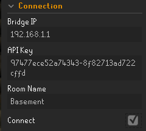

# Hue Phillips Integration Plugin

This plugin allows users to link their Hue Phillips smart lights in their home to their RuneLite client, creating a more immesrvie gaming expereince.

The plugin allows you to chose which color your Hue Phillips lights will turn to in certaint instances.

The plugin will interact with your lights when you recive expensive loot, die, recieve a raids drop, win a duel at duel arena, receive a pet, or level up. 

# Setup 

This plugin requires a little bit of setup in order to link your smartlights to your RuneLite client.

## Step 1

Once you have added the plugin to your RuneLite Client navigate to the configuration for the plugin. Enter the IP adress of your Phillips bridge, An API key for your Bridge, as well as the room you want the plugin to interact with.

If you are unsure on how to find your Phillips bridge IP adress visit this link : https://huetips.com/help/how-to-find-my-bridge-ip-address/ .

If you are unsure how to get an API key for your bridge follow the intructions here. https://developers.meethue.com/develop/get-started-2/ .

(The API key generated from that tutorial is Username string generated)

## Step 2

Once the correct information is entered in the configuration section go ahead and click on the connect checkbox. This will connect your Smart lights to Runlite and as long as the box stays checked, your Runelite will always be connected to the bridge. 

## Step 3

If youd like to verify if your smart lights have been linked sucessfuly in game type in chat "::testlights". A message in your in game chat box will tell you if you are connected or not.

## Step 4 
Go ahead and Enjoy!!!! (Note: In the occurance when you receive a valueable drop, the plugin reacts based on the chat message. Therefore, if your message trigger in the default Runescape is set to a different number and that message does not trigger, the plugin will not trigger either.)

