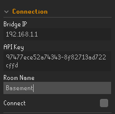
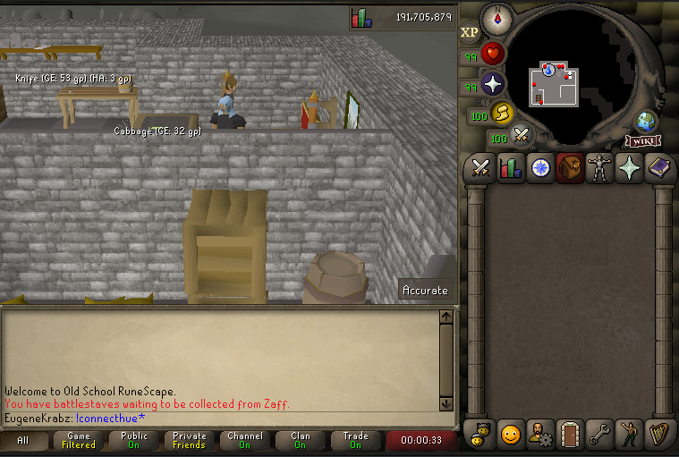
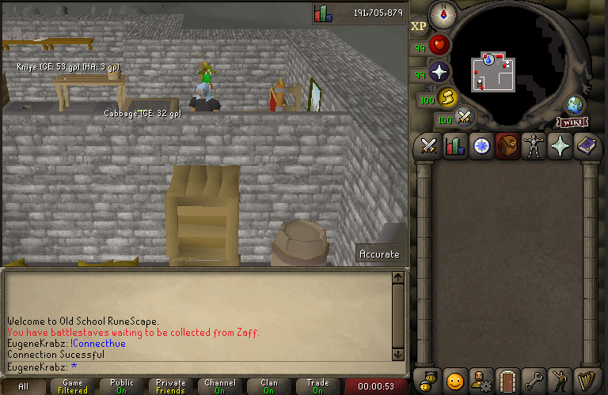

# Hue Phillips Integration Plugin

This plugin allows users to link their Hue Phillips smart lights in their home to their RuneLite client.

When the player receives a drop worth over 1M Gp your smart lights will react and turn green.

When the player died your smart lights will react and turn red.

When the player is in a raid and a team member receives a drop, the lights will react and turn purple

When the player receives a pet the lights will react and turn light blue!

# Setup 

This plugin requires a little bit of setup in order to link your smartlights to your RuneLite client.

## Step 1

Once you have added the plugin to your RuneLite Client navigate to the configuration for the plugin. Enter the IP adress of your Phillips bridge as well as the room 
that you'd like the client to link with.

If you are unsure on how to find your Phillips bridge IP adress visit this link : https://huetips.com/help/how-to-find-my-bridge-ip-address/ .

## Step 2

Once your IP adress and Room name has been entered correctly in game type the command !connecthue .

## Step 3 

Once you have typed this command you will have 30 seconds to click the button on your Phillips Bridge. If the connection was a succsess you will see a a message in game chat notifiying you that your connection was a sucesses.
(Note: Each time the client is opened if you'd like to use the plugin you must re connect the bridge)

## Step 4

 Enjoy the plugin and hopefully experience the green, purple and maybe even blue light.

